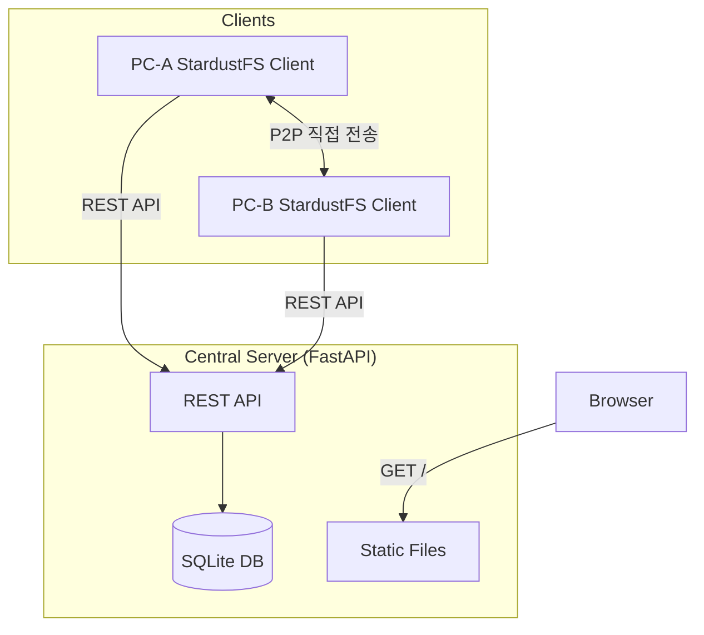
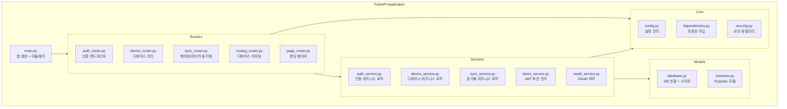
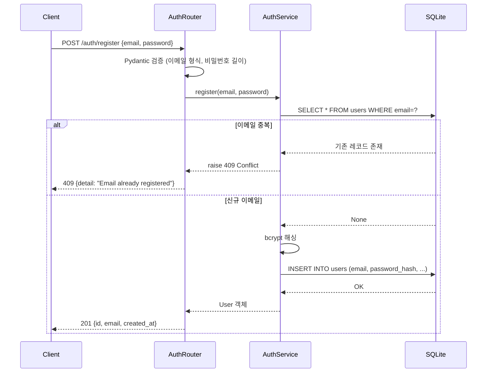
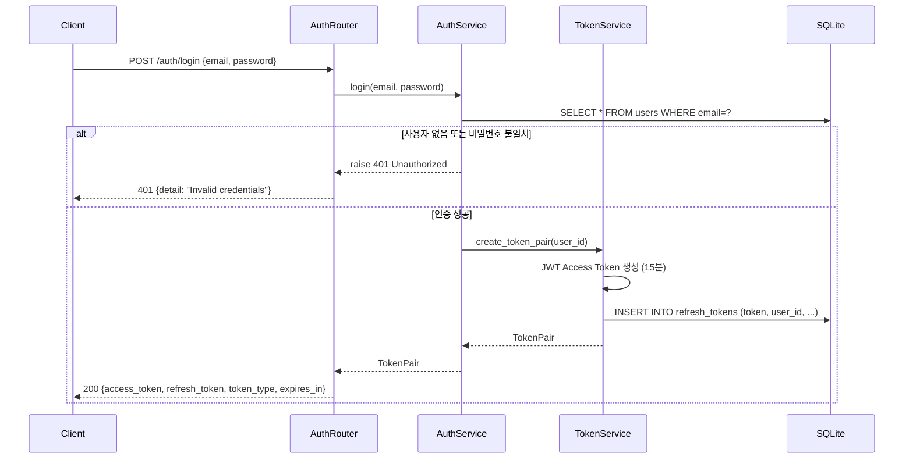
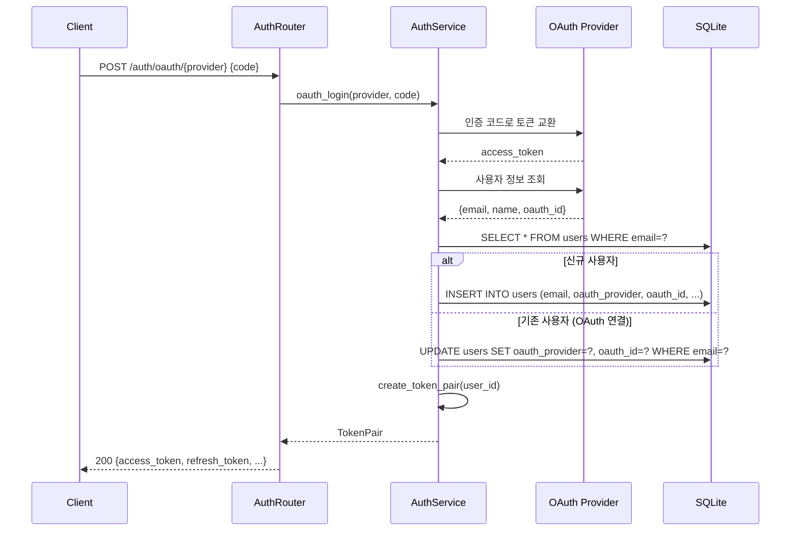
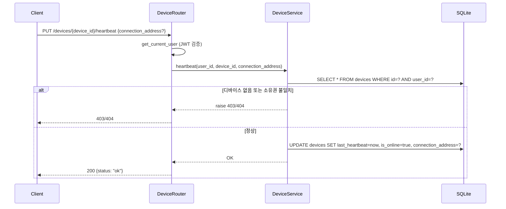
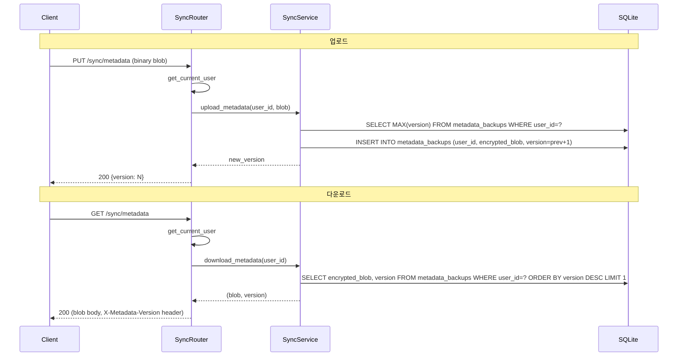

# Design Document: MVP2 Central Server

## Overview

StardustFS Central Server는 멀티디바이스 환경에서 제어 평면(control plane) 역할을 수행하는 FastAPI 기반 REST API 서버이다. 실제 파일 데이터는 클라이언트 간 P2P로 전송되며, 서버는 다음 핵심 기능만 담당한다:

- 사용자 인증 (이메일/비밀번호, OAuth)
- JWT 기반 토큰 관리 (발급, 갱신, 회전)
- 디바이스 등록 및 온라인 상태 관리
- 암호화된 메타데이터/키 백업 저장
- 디바이스 라우팅 정보 제공
- 서비스 랜딩 페이지 제공

기술 스택:
- Python 3.9+ (최소 요구 버전)
- FastAPI (ASGI 웹 프레임워크)
- SQLite + aiosqlite (비동기 데이터베이스)
- python-jose (JWT 토큰)
- passlib[bcrypt] (비밀번호 해싱)
- authlib (OAuth: Google, GitHub)
- uvicorn (ASGI 서버)
- Jinja2 (랜딩 페이지 템플릿)

Python 3.9 호환 규칙:
- 모든 .py 파일 첫 줄에 `from __future__ import annotations` 추가
- `match/case` 문법 사용 금지 (3.10+)
- `type X = ...` 문법 사용 금지 (3.12+)

## Architecture

### 시스템 컨텍스트



### 애플리케이션 구조



### 디렉토리 구조

```
stardustfs-server/
├── app/
│   ├── __init__.py
│   ├── main.py              # FastAPI 앱 생성, 미들웨어, 라우터 등록
│   ├── config.py            # 환경 설정 (Settings)
│   ├── database.py          # aiosqlite 연결 관리, 스키마 초기화
│   ├── dependencies.py      # 의존성 주입 (get_db, get_current_user)
│   ├── security.py          # JWT 생성/검증, 비밀번호 해싱
│   ├── schemas.py           # Pydantic 요청/응답 모델
│   ├── routers/
│   │   ├── __init__.py
│   │   ├── auth.py          # POST /auth/register, login, oauth, refresh
│   │   ├── devices.py       # GET/POST/DELETE /devices, PUT heartbeat
│   │   ├── sync.py          # GET/PUT /sync/metadata, /sync/key
│   │   ├── routing.py       # GET /routing/{device_id}
│   │   └── pages.py         # GET / (랜딩 페이지)
│   └── services/
│       ├── __init__.py
│       ├── auth_service.py  # 회원가입, 로그인, OAuth 로직
│       ├── device_service.py# 디바이스 CRUD, heartbeat
│       ├── sync_service.py  # 메타데이터/키 백업 관리
│       └── token_service.py # JWT 발급, 갱신, refresh token 관리
├── static/                  # CSS, JS, 이미지
├── templates/               # Jinja2 HTML 템플릿
│   └── landing.html
├── tests/
│   ├── __init__.py
│   ├── conftest.py          # pytest fixtures
│   ├── test_auth.py
│   ├── test_devices.py
│   ├── test_sync.py
│   └── test_routing.py
├── requirements.txt
├── pyproject.toml
└── README.md
```


## Components and Interfaces

### 라우터 (Routers)

각 라우터는 FastAPI의 `APIRouter`를 사용하며, 관련 엔드포인트를 그룹화한다.

#### auth_router (`/auth`)

| 메서드 | 경로 | 설명 | 인증 |
|--------|------|------|------|
| POST | `/auth/register` | 이메일/비밀번호 회원가입 | 불필요 |
| POST | `/auth/login` | 로그인, JWT 발급 | 불필요 |
| POST | `/auth/oauth/{provider}` | OAuth 로그인 (google/github) | 불필요 |
| POST | `/auth/refresh` | 토큰 갱신 | 불필요 (Refresh Token 사용) |

#### device_router (`/devices`)

| 메서드 | 경로 | 설명 | 인증 |
|--------|------|------|------|
| GET | `/devices` | 내 디바이스 목록 조회 | 필요 |
| POST | `/devices` | 디바이스 등록 | 필요 |
| DELETE | `/devices/{device_id}` | 디바이스 제거 | 필요 |
| PUT | `/devices/{device_id}/heartbeat` | Heartbeat 갱신 | 필요 |

#### sync_router (`/sync`)

| 메서드 | 경로 | 설명 | 인증 |
|--------|------|------|------|
| GET | `/sync/metadata` | 메타데이터 백업 다운로드 | 필요 |
| PUT | `/sync/metadata` | 메타데이터 백업 업로드 | 필요 |
| GET | `/sync/key` | 암호화 키 백업 다운로드 | 필요 |
| PUT | `/sync/key` | 암호화 키 백업 업로드 | 필요 |

#### routing_router (`/routing`)

| 메서드 | 경로 | 설명 | 인증 |
|--------|------|------|------|
| GET | `/routing/{device_id}` | 디바이스 라우팅 정보 조회 | 필요 |

#### page_router (`/`)

| 메서드 | 경로 | 설명 | 인증 |
|--------|------|------|------|
| GET | `/` | 랜딩 페이지 HTML | 불필요 |

### 서비스 계층 (Services)

#### AuthService

```python
class AuthService:
    async def register(self, email: str, password: str) -> User:
        """회원가입. 이메일 중복 검사 + bcrypt 해싱 후 저장."""
        ...

    async def login(self, email: str, password: str) -> TokenPair:
        """로그인. 비밀번호 검증 후 Access/Refresh Token 발급."""
        ...

    async def oauth_login(self, provider: str, code: str) -> TokenPair:
        """OAuth 인증 코드로 사용자 정보 조회 후 토큰 발급.
        신규 사용자면 자동 생성, 기존 이메일이면 계정 연결."""
        ...
```

#### TokenService

```python
class TokenService:
    async def create_token_pair(self, user_id: str) -> TokenPair:
        """Access Token(15분) + Refresh Token 쌍 생성."""
        ...

    async def refresh_tokens(self, refresh_token: str) -> TokenPair:
        """Refresh Token 검증 후 새 토큰 쌍 발급. 이전 토큰 무효화(회전)."""
        ...

    async def revoke_all_tokens(self, user_id: str) -> None:
        """해당 사용자의 모든 Refresh Token 무효화."""
        ...
```

#### DeviceService

```python
class DeviceService:
    async def register_device(
        self, user_id: str, name: str, os: str, connection_address: str
    ) -> Device:
        """디바이스 등록. is_online=True, last_heartbeat=now."""
        ...

    async def list_devices(self, user_id: str) -> list[Device]:
        """해당 사용자의 모든 디바이스 목록 반환."""
        ...

    async def delete_device(self, user_id: str, device_id: str) -> None:
        """디바이스 삭제. 소유권 검증 포함."""
        ...

    async def heartbeat(
        self, user_id: str, device_id: str, connection_address: str | None
    ) -> None:
        """last_heartbeat 갱신, 선택적으로 connection_address 갱신."""
        ...

    def is_device_online(self, last_heartbeat: datetime) -> bool:
        """last_heartbeat가 5분 이내인지 판단."""
        ...
```

#### SyncService

```python
class SyncService:
    async def upload_metadata(self, user_id: str, blob: bytes) -> int:
        """메타데이터 blob 저장, version 증가. 새 version 반환."""
        ...

    async def download_metadata(self, user_id: str) -> tuple[bytes, int]:
        """최신 메타데이터 blob + version 반환."""
        ...

    async def upload_key(self, user_id: str, blob: bytes) -> None:
        """암호화 키 blob 저장 (upsert)."""
        ...

    async def download_key(self, user_id: str) -> bytes:
        """암호화 키 blob 반환."""
        ...
```

### 핵심 모듈 (Core)

#### security.py

```python
from passlib.context import CryptContext
from jose import jwt

pwd_context = CryptContext(schemes=["bcrypt"], deprecated="auto")

def hash_password(password: str) -> str:
    """비밀번호를 bcrypt로 해싱."""
    ...

def verify_password(plain: str, hashed: str) -> bool:
    """비밀번호 검증."""
    ...

def create_access_token(data: dict, expires_minutes: int = 15) -> str:
    """JWT Access Token 생성. exp 클레임 포함."""
    ...

def create_refresh_token(data: dict) -> str:
    """JWT Refresh Token 생성."""
    ...

def decode_token(token: str) -> dict:
    """JWT 디코딩 및 검증. 만료/서명 오류 시 예외 발생."""
    ...
```

#### dependencies.py

```python
from fastapi import Depends, HTTPException
from fastapi.security import HTTPBearer, HTTPAuthorizationCredentials

security_scheme = HTTPBearer()

async def get_db() -> AsyncGenerator[aiosqlite.Connection, None]:
    """aiosqlite 연결을 yield하는 의존성."""
    ...

async def get_current_user(
    credentials: HTTPAuthorizationCredentials = Depends(security_scheme),
    db = Depends(get_db),
) -> dict:
    """Bearer 토큰에서 user_id 추출. 유효하지 않으면 401."""
    ...
```

### 주요 흐름 시퀀스 다이어그램

#### 회원가입 흐름



#### 로그인 흐름



#### OAuth 로그인 흐름



#### 디바이스 Heartbeat 흐름



#### 메타데이터 동기화 흐름




## Data Models

### 데이터베이스 스키마 (SQLite)

```sql
-- 사용자 테이블
CREATE TABLE users (
    id TEXT PRIMARY KEY DEFAULT (lower(hex(randomblob(16)))),
    email TEXT NOT NULL UNIQUE,
    password_hash TEXT,          -- OAuth 전용 사용자는 NULL 가능
    oauth_provider TEXT,         -- 'google', 'github', NULL
    oauth_id TEXT,               -- OAuth 제공자의 사용자 ID
    created_at TEXT NOT NULL DEFAULT (datetime('now'))
);

-- 디바이스 테이블
CREATE TABLE devices (
    id TEXT PRIMARY KEY DEFAULT (lower(hex(randomblob(16)))),
    user_id TEXT NOT NULL REFERENCES users(id) ON DELETE CASCADE,
    name TEXT NOT NULL,
    os TEXT NOT NULL,
    connection_address TEXT NOT NULL,
    last_heartbeat TEXT NOT NULL DEFAULT (datetime('now')),
    is_online INTEGER NOT NULL DEFAULT 1,
    created_at TEXT NOT NULL DEFAULT (datetime('now'))
);

CREATE INDEX idx_devices_user_id ON devices(user_id);

-- 메타데이터 백업 테이블
CREATE TABLE metadata_backups (
    id INTEGER PRIMARY KEY AUTOINCREMENT,
    user_id TEXT NOT NULL REFERENCES users(id) ON DELETE CASCADE,
    encrypted_blob BLOB NOT NULL,
    version INTEGER NOT NULL DEFAULT 1,
    uploaded_at TEXT NOT NULL DEFAULT (datetime('now'))
);

CREATE INDEX idx_metadata_backups_user_id ON metadata_backups(user_id);
CREATE UNIQUE INDEX idx_metadata_backups_user_version ON metadata_backups(user_id, version);

-- 키 백업 테이블
CREATE TABLE key_backups (
    id INTEGER PRIMARY KEY AUTOINCREMENT,
    user_id TEXT NOT NULL UNIQUE REFERENCES users(id) ON DELETE CASCADE,
    encrypted_blob BLOB NOT NULL,
    uploaded_at TEXT NOT NULL DEFAULT (datetime('now'))
);

-- Refresh Token 테이블 (토큰 회전 관리)
CREATE TABLE refresh_tokens (
    id INTEGER PRIMARY KEY AUTOINCREMENT,
    user_id TEXT NOT NULL REFERENCES users(id) ON DELETE CASCADE,
    token_hash TEXT NOT NULL UNIQUE,  -- SHA-256 해시로 저장
    is_revoked INTEGER NOT NULL DEFAULT 0,
    created_at TEXT NOT NULL DEFAULT (datetime('now')),
    expires_at TEXT NOT NULL
);

CREATE INDEX idx_refresh_tokens_user_id ON refresh_tokens(user_id);
CREATE INDEX idx_refresh_tokens_token_hash ON refresh_tokens(token_hash);
```

### Pydantic 스키마 (Request/Response Models)

```python
from pydantic import BaseModel, EmailStr, Field
from datetime import datetime

# === Auth 관련 ===

class RegisterRequest(BaseModel):
    email: EmailStr
    password: str = Field(min_length=8)

class LoginRequest(BaseModel):
    email: EmailStr
    password: str

class OAuthRequest(BaseModel):
    code: str

class TokenResponse(BaseModel):
    access_token: str
    refresh_token: str
    token_type: str = "bearer"
    expires_in: int = 900  # 15분 = 900초

class RefreshRequest(BaseModel):
    refresh_token: str

class UserResponse(BaseModel):
    id: str
    email: str
    created_at: datetime

# === Device 관련 ===

class DeviceCreateRequest(BaseModel):
    name: str = Field(min_length=1)
    os: str
    connection_address: str

class DeviceResponse(BaseModel):
    id: str
    name: str
    os: str
    connection_address: str
    is_online: bool
    last_heartbeat: datetime
    created_at: datetime

class HeartbeatRequest(BaseModel):
    connection_address: str | None = None

# === Sync 관련 ===

class MetadataUploadResponse(BaseModel):
    version: int

class MetadataDownloadResponse(BaseModel):
    version: int
    # blob은 Response body로 직접 반환 (application/octet-stream)

# === Routing 관련 ===

class RoutingResponse(BaseModel):
    device_id: str
    connection_address: str
    is_online: bool
    last_heartbeat: datetime

# === 공통 ===

class ErrorResponse(BaseModel):
    detail: str
```

### 설정 모델 (config.py)

```python
from pydantic_settings import BaseSettings

class Settings(BaseSettings):
    # 서버 설정
    app_name: str = "StardustFS Central Server"
    debug: bool = False
    host: str = "0.0.0.0"
    port: int = 8000

    # 데이터베이스
    database_url: str = "data/stardustfs.db"

    # JWT 설정
    jwt_secret_key: str  # 환경변수 필수
    jwt_algorithm: str = "HS256"
    access_token_expire_minutes: int = 15
    refresh_token_expire_days: int = 30

    # OAuth 설정
    google_client_id: str = ""
    google_client_secret: str = ""
    github_client_id: str = ""
    github_client_secret: str = ""

    # Heartbeat 설정
    heartbeat_timeout_minutes: int = 5

    class Config:
        env_file = ".env"
        env_prefix = "STARDUST_"
```


## Correctness Properties

*속성(property)이란 시스템의 모든 유효한 실행에서 참이어야 하는 특성 또는 동작이다. 속성은 사람이 읽을 수 있는 명세와 기계가 검증할 수 있는 정확성 보장 사이의 다리 역할을 한다.*

### Property 1: 비밀번호 해싱 라운드트립

*For any* 유효한 비밀번호 문자열(8자 이상), `hash_password`로 해싱한 후 `verify_password`로 원본 비밀번호를 검증하면 항상 True를 반환해야 하며, 해시값은 원본과 달라야 한다.

**Validates: Requirements 1.3**

### Property 2: JWT 토큰 라운드트립

*For any* 유효한 user_id 문자열, `create_access_token({"sub": user_id})`로 생성한 토큰을 `decode_token`으로 디코딩하면 동일한 user_id를 포함하는 페이로드를 반환해야 한다.

**Validates: Requirements 2.4, 2.5**

### Property 3: 유효하지 않은 이메일 거부

*For any* '@'를 포함하지 않거나 도메인 부분이 없는 문자열, 회원가입 요청 시 422 응답을 반환해야 한다.

**Validates: Requirements 1.4**

### Property 4: 짧은 비밀번호 거부

*For any* 1~7자 길이의 문자열, 회원가입 요청 시 422 응답을 반환해야 한다.

**Validates: Requirements 1.5**

### Property 5: 이메일 중복 가입 거부

*For any* 유효한 이메일과 비밀번호 조합, 동일 이메일로 두 번 가입을 시도하면 첫 번째는 201, 두 번째는 409를 반환해야 한다.

**Validates: Requirements 1.2**

### Property 6: 디바이스 등록 초기 상태

*For any* 유효한 디바이스 정보(이름, OS, 접속 주소), 등록 후 조회하면 is_online=true이고 last_heartbeat가 등록 시점 ±1초 이내여야 한다.

**Validates: Requirements 5.1, 5.3, 5.4**

### Property 7: 디바이스 목록 완전성 및 격리

*For any* 두 사용자 A, B가 각각 임의 개수의 디바이스를 등록한 경우, A의 디바이스 목록에는 A가 등록한 모든 디바이스만 포함되고 B의 디바이스는 포함되지 않아야 하며, 각 디바이스에는 id, name, os, connection_address, is_online, last_heartbeat 필드가 존재해야 한다.

**Validates: Requirements 6.1, 6.2, 6.3**

### Property 8: 디바이스 소유권 격리

*For any* 사용자 A의 디바이스에 대해, 다른 사용자 B가 삭제, heartbeat, 라우팅 조회를 시도하면 항상 403 Forbidden을 반환해야 한다.

**Validates: Requirements 7.3, 8.3, 13.3**

### Property 9: Heartbeat 갱신

*For any* 디바이스와 임의의 새 connection_address, heartbeat 전송 후 디바이스를 조회하면 last_heartbeat가 갱신되고 connection_address가 새 값으로 변경되어야 한다.

**Validates: Requirements 8.1, 8.2**

### Property 10: Heartbeat 타임아웃 판정

*For any* 시간차 값 t, t >= 5분이면 is_online=false, t < 5분이면 is_online=true로 판정해야 한다.

**Validates: Requirements 8.4**

### Property 11: 메타데이터 백업 라운드트립

*For any* 임의의 바이트열 시퀀스 [b1, b2, ..., bn]을 순서대로 업로드한 후 다운로드하면, 마지막으로 업로드한 bn과 동일한 데이터를 반환하고 version=n이어야 한다.

**Validates: Requirements 9.1, 9.2, 10.1, 10.3**

### Property 12: 키 백업 라운드트립

*For any* 임의의 바이트열, 키 업로드 후 다운로드하면 동일한 바이트열을 반환해야 한다. 두 번째 업로드 시 기존 값을 덮어쓰고, 다운로드하면 최신 값을 반환해야 한다.

**Validates: Requirements 11.1, 11.2, 12.1**

### Property 13: Refresh Token 회전 보안

*For any* 유효한 refresh token으로 갱신을 수행하면, (1) 이전 refresh token은 즉시 무효화되어야 하고, (2) 무효화된 토큰으로 재갱신을 시도하면 401을 반환하며 해당 사용자의 모든 refresh token이 무효화되어야 한다.

**Validates: Requirements 4.3, 4.4**

### Property 14: 인증 미들웨어 거부

*For any* 보호된 엔드포인트에 대해, (1) Authorization 헤더가 없거나, (2) 만료된 토큰이거나, (3) 잘못된 서명의 토큰이면 항상 401 Unauthorized를 반환해야 한다.

**Validates: Requirements 14.1, 14.2, 14.3**


## Error Handling

### HTTP 상태 코드 전략

| 상태 코드 | 사용 상황 |
|-----------|----------|
| 200 | 정상 응답 (조회, 갱신 성공) |
| 201 | 리소스 생성 성공 (회원가입, 디바이스 등록) |
| 204 | 삭제 성공 (응답 body 없음) |
| 400 | 잘못된 요청 (미지원 OAuth provider 등) |
| 401 | 인증 실패 (토큰 없음/만료/위조, 잘못된 자격증명) |
| 403 | 권한 없음 (다른 사용자의 리소스 접근) |
| 404 | 리소스 없음 (존재하지 않는 디바이스/백업) |
| 409 | 충돌 (이메일 중복) |
| 422 | 검증 실패 (Pydantic 검증 오류) |
| 500 | 서버 내부 오류 |

### 에러 응답 형식

모든 에러 응답은 일관된 JSON 형식을 사용한다:

```json
{
    "detail": "에러 메시지 설명"
}
```

422 검증 오류의 경우 FastAPI 기본 형식을 따른다:

```json
{
    "detail": [
        {
            "loc": ["body", "email"],
            "msg": "value is not a valid email address",
            "type": "value_error"
        }
    ]
}
```

### 예외 처리 계층

```python
# 커스텀 예외 정의
class StardustException(Exception):
    """기본 예외 클래스."""
    def __init__(self, status_code: int, detail: str):
        self.status_code = status_code
        self.detail = detail

class DuplicateEmailError(StardustException):
    def __init__(self):
        super().__init__(409, "Email already registered")

class InvalidCredentialsError(StardustException):
    def __init__(self):
        super().__init__(401, "Invalid credentials")

class DeviceNotFoundError(StardustException):
    def __init__(self):
        super().__init__(404, "Device not found")

class DeviceAccessDeniedError(StardustException):
    def __init__(self):
        super().__init__(403, "Access denied to this device")

class TokenExpiredError(StardustException):
    def __init__(self):
        super().__init__(401, "Token has expired")

class TokenInvalidError(StardustException):
    def __init__(self):
        super().__init__(401, "Invalid token")

class BackupNotFoundError(StardustException):
    def __init__(self, backup_type: str):
        super().__init__(404, f"{backup_type} backup not found")
```

### 전역 예외 핸들러

```python
@app.exception_handler(StardustException)
async def stardust_exception_handler(request, exc: StardustException):
    return JSONResponse(
        status_code=exc.status_code,
        content={"detail": exc.detail},
    )
```

### 보안 관련 에러 처리 원칙

1. 인증 실패 시 구체적인 원인을 노출하지 않는다 (이메일 존재 여부 등)
2. 401 응답에는 동일한 메시지("Invalid credentials")를 사용한다
3. 토큰 재사용 감지 시 해당 사용자의 모든 세션을 무효화한다
4. 내부 오류 발생 시 스택 트레이스를 클라이언트에 노출하지 않는다


## Testing Strategy

### 테스트 프레임워크

- pytest + pytest-asyncio (비동기 테스트)
- httpx (FastAPI TestClient 대체, 비동기 지원)
- hypothesis (Property-Based Testing)
- factory_boy 또는 직접 fixture (테스트 데이터 생성)

### 이중 테스트 접근법

#### 1. Property-Based Tests (hypothesis)

각 정확성 속성(Correctness Property)에 대해 최소 100회 반복 실행하는 property test를 작성한다.

설정:
- `@settings(max_examples=100)` 이상
- 각 테스트에 속성 번호를 태그로 포함

태그 형식:
```python
# Feature: mvp2-central-server, Property 1: 비밀번호 해싱 라운드트립
@given(password=st.text(min_size=8, max_size=128))
@settings(max_examples=100)
def test_password_hash_roundtrip(password):
    hashed = hash_password(password)
    assert hashed != password
    assert verify_password(password, hashed)
```

Property test 대상:
- Property 1: 비밀번호 해싱 라운드트립
- Property 2: JWT 토큰 라운드트립
- Property 3: 유효하지 않은 이메일 거부
- Property 4: 짧은 비밀번호 거부
- Property 5: 이메일 중복 가입 거부
- Property 6: 디바이스 등록 초기 상태
- Property 7: 디바이스 목록 완전성 및 격리
- Property 8: 디바이스 소유권 격리
- Property 9: Heartbeat 갱신
- Property 10: Heartbeat 타임아웃 판정
- Property 11: 메타데이터 백업 라운드트립
- Property 12: 키 백업 라운드트립
- Property 13: Refresh Token 회전 보안
- Property 14: 인증 미들웨어 거부

#### 2. Example-Based Unit Tests (pytest)

구체적인 시나리오와 에지 케이스를 검증한다:

- 로그인 실패 시나리오 (미등록 이메일, 잘못된 비밀번호)
- OAuth 계정 연결 시나리오
- 미지원 OAuth provider 거부
- 디바이스 삭제 성공/실패
- 백업 미존재 시 404 반환
- 랜딩 페이지 HTML 콘텐츠 검증
- 빈 body 업로드 거부 (422)

#### 3. Integration Tests

OAuth 외부 서비스 연동을 mock 기반으로 검증:

- Google OAuth 인증 코드 교환 + 사용자 정보 조회
- GitHub OAuth 인증 코드 교환 + 사용자 정보 조회
- OAuth provider 실패 시 에러 전파

#### 4. Smoke Tests

DB 스키마 초기화 검증:

- 모든 테이블 존재 확인
- 컬럼 구조 확인
- UNIQUE/FK 제약 조건 동작 확인

### 테스트 구조

```
tests/
├── conftest.py              # 공통 fixture (test DB, test client, 인증 헬퍼)
├── test_auth_properties.py  # Property 1-5, 13-14
├── test_device_properties.py# Property 6-10
├── test_sync_properties.py  # Property 11-12
├── test_auth_examples.py    # 로그인 실패, OAuth 시나리오
├── test_device_examples.py  # 디바이스 삭제, 에지 케이스
├── test_sync_examples.py    # 백업 미존재, 빈 body
├── test_pages.py            # 랜딩 페이지 검증
├── test_oauth_integration.py# OAuth mock 통합 테스트
└── test_schema_smoke.py     # DB 스키마 검증
```

### 테스트 실행

```bash
# 전체 테스트
pytest

# Property tests만
pytest tests/test_*_properties.py

# 특정 property
pytest tests/test_auth_properties.py -k "password_hash_roundtrip"
```

### 보안 설계 요약

| 위협 | 대응 |
|------|------|
| 비밀번호 유출 | bcrypt 해싱 (cost factor 12) |
| 토큰 탈취 | Access Token 15분 만료 |
| Refresh Token 탈취 | 토큰 회전 + 재사용 감지 시 전체 무효화 |
| 서버 DB 유출 | Refresh Token은 SHA-256 해시로 저장 |
| 메타데이터/키 유출 | 클라이언트 측 암호화, 서버는 불투명 blob만 보관 |
| MITM 공격 | HTTPS 필수 (프로덕션) |
| 무차별 대입 | Rate limiting (향후 추가) |
